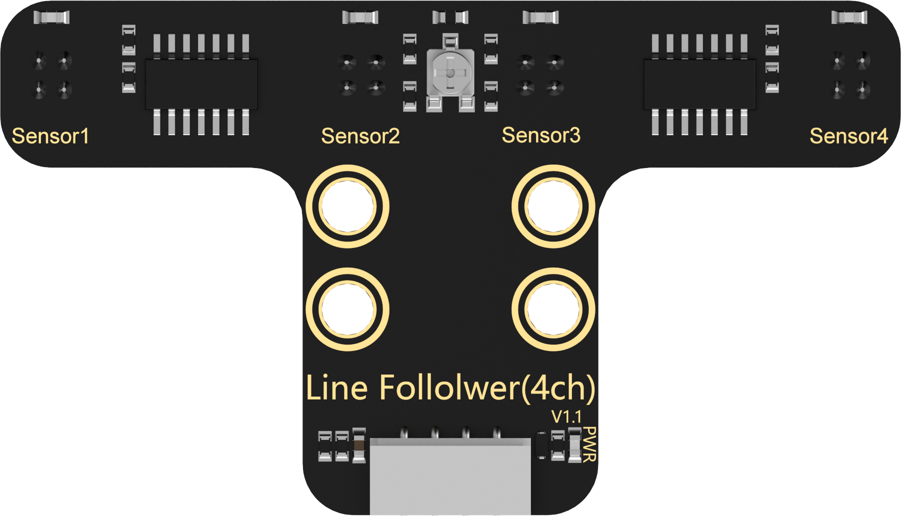
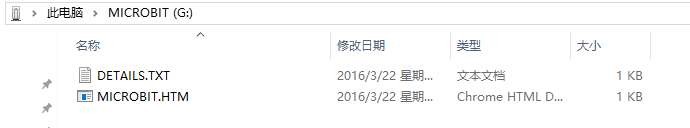
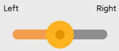

# 1. Get Started

## 1.1 Unboxing Overview

### 1.1.1 Qtruck Packing List

| No. | **Components** | Quantity | **Picture**                                                                    |
|:---:|:-------------------------:|-----|--------------------------------------------------------------------------------|
|       1       |       Chassis Bracket        | 1 |   |
|     2     |     Robotic arm bracket      | 7 |   |
|       3       |       Gripper bracket        | 1 |   |
| 4 | Gripper support plate | 1 |   |
| 5 | Gripper + rubber sleeves * 2 | 4 |   |
| 6 | Motor | 2 |   |
| 7 | Driven wheel disk | 4 |   |
| 8 | Coupling | 2 |  |
| 9 | wheel | 4 |   |
| 10 | Track | 2 |   |
| 11 | microbit expansion board | 1 |  |
| 12 | microbit board(optional) | 1 |  |
| 13 | ultrasonic sensor | 1 |                       |
| 14 | 4-CH Following Sensor | 1 |  |
| 15 | LFD-01M servo | 3 |                        |
| 16 | 18650 LiPo battery | 1 |  |
| 17 | 4PIN sensor wire | 2 |  |
| 18 | USB data cable | 1 |  |
| 19 | Accessory bag | 1 |  |
| 20 | User manual | 1 |  |

### 1.1.2 Controller System Instruction

Figure 1. Front Layout of the micro:bit Main Board

Figure 2. Back Layout of the micro:bit Main Board

* **micro:bit Expansion Board**

Figure 3. Front Layout of the micro:bit Expansion Board

| 1.RGB light module | 2.Serial communication interface |
|:--:|:--:|
| 3.micro:bit socket | 4.I2C interface |
| 5.Power output interface | 6.Motor interface |
| 7.PWM servo interface | 8.Power switch |
| 9.DC power interface | 10.IO interface |

Figure 4. Back Layout of the micro:bit Expansion Board

## 1.2 Assembly (Main Form)

### 1.2.1 Assembly Vedio

[补充视频]

### 1.2.2 Assembly Notice and FAQ

* **Notice**

(1) Since the product contains small parts, kids under 12 must use it under adult supervision.

(2) Pictures in document are for reference only, please subject to your available Qtruck.

(3) Please strictly follow tutorial to get robot and sensors assembled.

(4) Be careful when using screws, screwdriver and spanner!

(5) Do not let metal objects or liquid touch controller and electronic components on it, otherwise product may be damaged.

(6) When assemble servo, please ensure the servo is in the middle position (the default position). If the main shaft is rotated carelessly, please refer to **"Robotic Arm Adjustment"**.

(7) The insert direction of micro:bit board is shown below: 26 LED lights faces upwards.

* **FAQ**

(1) Q1: Is it hard to twist M3 anti-slip nut?

A: You need to use the provided wrench to tighten M3 anti-slip nut.

(2) Q2: Will the wheels tilt after the track is assembled?

A: This situation is caused by improper installation of track so the track is too tight and squeezes the wheels. Please refer to the document **"Track Adjustment"** in Appendix.

(3) Q3: How to remove the rivet?

A: Use screwdriver to slightly push the rivet outward until its head pops up, then directly pull it out. (Be careful to use screwdriver and other tools. Kids should use them under adult supervision.)

### 1.2.3 Rivet Model Differences for Qtruck Color Versions

If you purchased the Qtruck color version (green/blue), please note that only the rivet models differ from the white version when assembling the robotic arm. The assembly steps and methods remain exactly the same, [Click here to view the comparison diagram](#anchor_comparison_diagram). The model comparison is shown in the table below:

(1) Robotic Arm Assembly on the Servo Shaft

| White Version Model & Quantity | Green/Blue Version Model & Quantity |
|:-------------------------------|:------------------------------------|
| R3100 Rivet ×1 | R3080 Rivet ×1 |

(2) Parallel Bracket Installation

| White Version Model & Quantity | Green/Blue Version Model & Quantity |
|:-------------------------------|:------------------------------------|
| R3100 Rivet ×2 | R3080 Rivet ×2 |

| White Version Model & Quantity | Green/Blue Version Model & Quantity |
|:-------------------------------|:------------------------------------|
| R3075 Rivet ×2 | R3055 Rivet ×2 |

(3) Fixed Bracket Installation

| White Version Model & Quantity | Green/Blue Version Model & Quantity |
|:-------------------------------|:------------------------------------|
| R3075 Rivet ×4 | R3055 Rivet ×4 |

(4) Upper Secondary Arm Installation (Other Side)

| White Version Model & Quantity | Green/Blue Version Model & Quantity |
|:-------------------------------|:------------------------------------|
| R3075 Rivet ×2 | R3055 Rivet ×2 |

(5) Lower Secondary Arm Installation (Other Side)

:::{Note}
Comparison image of Rivet R3055 and R3080
:::

<table class="" style="text-align: center;width: 600px;">
    <tbody>
    <tr>
        <td></td>
        <td></td>
    </tr>
    <tr>
        <td>Left: Rivet R3055</td>
        <td>Right: Rivet R3080</td>
    </tr>
    </tbody>
</table>

### 1.2.4 Screw Model Reference Guide

## 1.3 Build Programming Environment

* **Visiting Method**

(1) First, connect `micro:bit` board to computer. Then a **"MICROBIT"** disk will pop up. Double click HTM file, open it by browser and computer must connect to internet.

:::{Note}
micro:bit  drive only has two files, as the picture shown above. The file "DETAILS.TXT" is used to record some of `micro:bit` parameters.
:::

(2) In the opening page, click **"Let's code"**, **"MakeCode editor"** in sequence to enter the programming interface.

(3) Click **"New Project"**. Then enter the project name in pop up window to enter the home page of programming.

(4) Also, you can enter website <https://makecode.microbit.org/> in search box of browser to directly visit editor. The website will automatically jump to the home page of Makecode programming.

* **Programming Layout Introduction**

The layout of home page is as follow:

| Area (from left to right) | Function |
|:--:|:--:|
| Simulation area | Programming command block simulation |
| Tag selection area | Use the available command block or the command block added in expansion package. |
| Programming edit area | Command block edit area. For insert, copy, paste, delete, modify, etc. |

* **Way to Add Expansion Package**

(1) Click **"Extensions"** at left side in sequence.

(2) Enter the address of the expansion package in pop up interface: <https://github.com/Hiwonder/StartbitV2>. Then click on search icon to search Startbit or StartbitV2 software package, and click it to add.

(3) At this moment, the current page will automatically return to programming interface. Wait for the loading to complete. Then you can find the added expansion package on program bar. Click "**StartbitV2**" tag to unfold it.

* **Programming Method**

Take **"heart shape light"** as example.

(1) First of all, click **"Basic"** and drag the corresponding command block to program edit area, as the picture shown below.

(2) Clicking **"Save"** button to save program for later debug. If you want to change the saved name, you can rename it directly in the box on the left.

* **Connect Device And Download Program**

(1) Match Device

Please match device for first connection. After successful connection, browser will record the connected device.

① Click **"..."** button next to **"Download"** and select **"Connect Device"**.

② Then click **"Next"**, as pictures shown below.

③ Select **"BBC micro:bit CMSIS-DAP"** and click **"Connect".**

(2) Download Program

[Source Code]()

① Method 1

After device is connected successfully, click **"Download".** The yellow beacon on `micro:bit` near USB port will blink fast. At this time, do not disconnect or move USB cable to avoid failure download.

After download is completed, the beacon will stop blinking and keep lighting up. The home page of programming will prompt "**Download completed**".

② Method 2

If no need to modify program or download program without network, the saved program file (ending with `hex`) can be directly copied to `micro:bit` disk for download.

When downloading, the process prompt window will pop up. After the download is complete, the disk will automatically eject.

:::{Note}
The original program in Qtruck will be replaced by the new program that is copied to disk. The downloaded program file is invisible in disk.
:::

:::{Note}
micro:bit drive only has two files all the time. The file "**DETAILS.TXT**" is used to recording some of `micro:bit` parameters. Clicking MICROBIT.HTM file can jump to `micro:bit` official website.
:::

Micro:bit  can automatically execute program after powering on, look at the below effect.

## 1.4 APP Control

### 1.4.1 Introduction to micro:bit V2.0

Based on the original function of `micro:bit` V1.5, the new generation of `micro:bit` V2.0 has been optimized and improved in computing power and performance, as well as add several onboard modules for expansion.

All functions of `micro:bit` V1.5 can be implemented in `micro:bit` V2. Therefore, the tutorial for `micro:bit` V1.5 is applicable to `micro:bit` V2.0.

Regarding the new features of `micro:bit` V2.0, please see the related lessons.

The following table shows the comparison between two boards and the red parts highlights the new function of `micro:bit` V2.0.

<table class="docutils-nobg" border="1">
  <thead>
    <tr>
      <th>No.</th>
      <th>Name</th>
      <th>micro:bit V1.5</th>
      <th>micro:bit V2.0</th>
    </tr>
  </thead>
  <tbody>
    <tr>
      <td rowspan="2">1</td>
      <td>Front side</td>
      <td></td>
      <td></td>
    </tr>
    <tr>
      <td>Back side</td>
      <td></td>
      <td></td>
    </tr>
    <tr>
      <td>2</td>
      <td>Processor</td>
      <td>Nordic nRF51822</td>
      <td>Nordic nRF52833</td>
    </tr>
    <tr>
      <td>3</td>
      <td>ARM</td>
      <td>Cortex-M0 32bit 16MHz</td>
      <td>Cortex-M4 32bit+FPU 64MHz</td>
    </tr>
    <tr>
      <td>4</td>
      <td>Memory</td>
      <td>16KB RAM/256KB Flash</td>
      <td>128KB RAM/512KB Flash</td>
    </tr>
    <tr>
      <td>5</td>
      <td>Touch sensitive logo</td>
      <td>None</td>
      <td>Onboard touch sensor</td>
    </tr>
    <tr>
      <td>6</td>
      <td>microphone</td>
      <td>None</td>
      <td>Onboard microphone with LED indicator</td>
    </tr>
    <tr>
      <td>7</td>
      <td>Speaker</td>
      <td>None</td>
      <td>Onboard electromagnetic speaker</td>
    </tr>
    <tr>
      <td>8</td>
      <td>Pins</td>
      <td>Flat</td>
      <td>Gear shape</td>
    </tr>
    <tr>
      <td>9</td>
      <td>Reset Button</td>
      <td>Reset function</td>
      <td>Reset function, long press to enter power saving mode</td>
    </tr>
    <tr>
      <td>10</td>
      <td>Power indicator</td>
      <td>None</td>
      <td>Emit red light when supplying power</td>
    </tr>
    <tr>
      <td>11</td>
      <td>Bluetooth</td>
      <td>Bluetooth 4.0</td>
      <td>Bluetooth 5.0</td>
    </tr>
    <tr>
      <td>12</td>
      <td>Working current</td>
      <td>90mA</td>
      <td>300mA</td>
    </tr>
  </tbody>
</table>

### 1.4.2 APP Control

:::{Note}
This lesson take iOS system as example and also applicable to Android system.
:::

iOS user can directly search and download [Wonderbit](https://apps.apple.com/us/app/wonderbit/id1462598241) in APP Store.

* **Program Download**

[Source Code]()

(1) Please find **"Qtruck-Bluetooth control.hex"** program under folder **"APP Control Program"**.

(2) Copy the program to `micro:bit` disk.

(3) After downloading, hex file is not visible in disk drive and the disk drive will automatically flash out. Also, you can see that the indicator next to USB port emits yellow light. The indicator will blink rapidly and continuously while your program is transferred and will stop flashing and keep on after transfer is complete.

:::{Note}
After transfer is complete, hex file will disappear in `micro:bit` disk. After power on `micro:bit`, your program starts running on your `micro:bit` automatically.
:::

* **Install APP**

Find and transfer [Wonderbit.apk](https://play.google.com/store/apps/details?id=com.hiwonder.wonderbit) installation package (only for Android user) to your phone. Download apk file on your phone and install app.

* **Connect to APP**

:::{Note}
* Before using app, please enable Bluetooth and GPS service in phone settings.
* Click Bluetooth button on app to pair with robot. Do not connect robot by Bluetooth in your phone settings.
:::

(1) Enable Bluetooth and GPS service.

(2) Open Wonderbit. Click on  to select "**Qtruck**".

(3) Click on  and select "**BBC micro:bit**" in pop-up device search list to connect.

(4) At the same time, keep your phone close to Qtruck. After connection is complete, Bluetooth icon on app will stop flashing and light up.

* **App Control**

There are two functions on home interface of app including color light and servo control functions.

First of all, please learn about the color light function.

| Icon | Function |
|:--:|:--:|
|  | Control Qtruck to go forward or backward and turn left or right. |
|  | Display light intensity of environment where Qtruck is located. |
|  | Display the distance between Qtruck and object ahead. |
|  | Display temperature of environment where Qtruck is located. |
|  | Turn on this button, two color light on Qtruck emit random light (the light color is contained in surroundings). |
|  | Turn on or off the color light. |
|  | Turn on Gravity control, you can tilt your phone to control Qtruck to move. |
|  | Control Qtruck's light color. |
|  | Click this button to open servo control interface. |

The home interface of servo control is as follow.

| Icon | Function |
|:--:|:--:|
|  | Control ID3 servo, i.e., gripper. |
|  | Control ID2 servo, i.e., the middle part of robotic arm. |
|  | Control ID3 servo, i.e., the distal part of robotic arm. |