# 2.Basic Lesson

## 2.1 Go Forward

### 2.1.1 Preparation

The motor ports on Qtruck are shown in the picture below. Please connect the motor cable to the motor port on the same side.

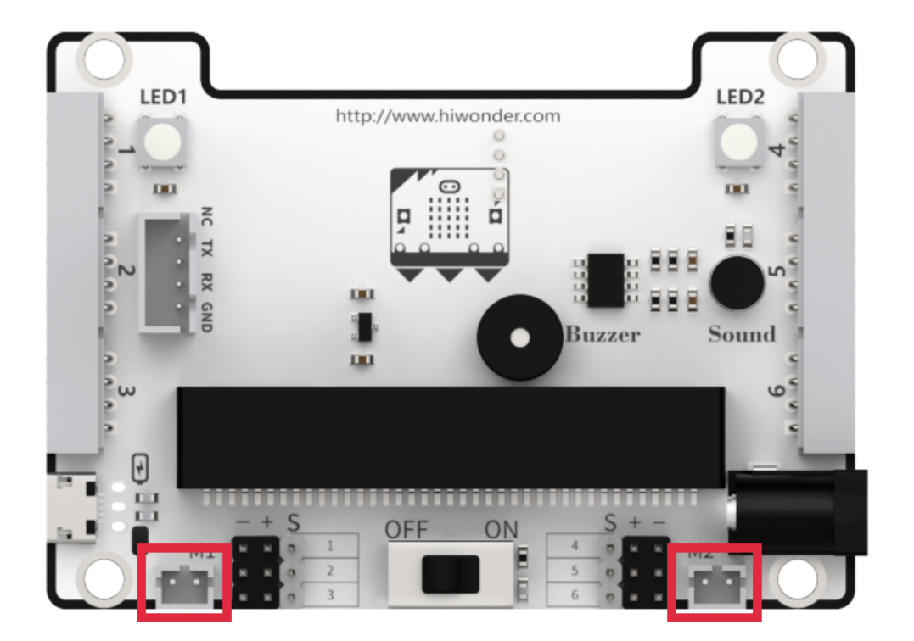

### 2.1.2 Learning Objective

(1) Learn how to use motor block coding.

(2) Program Qtruck to go forward.

### 2.1.3 Project Logic

The Qtruck robot is equipped with two geared motors, which can be controlled through programming to drive the motors and achieve forward movement.

### 2.1.4 Program Writing

* **Extension Package adding method**

Online programming: click [https://makecode.microbit.org/]() to enter the programming interface. After creating a new project, click **Extensions** to add the Hiwonder software package for programming.

Add [https://github.com/Hiwonder/Startbit]() for micor:bit V1.5.

Add [https://github.com/Hiwonder/StartbitV2]() for micro:bit V2.0.

:::{Note}

Please select the expansion package corresponding to the version of micro:bit. The version of micro:bit can be viewed at the lower right corner of the board.

:::

* **Block Coding Learning**

<table class="docutils-nobg" border="1">
  <thead>
    <tr>
      <th>Block Coding</th>
      <th>Class</th>
      <th>Function</th>
    </tr>
  </thead>
  <tbody>
    <tr>
      <td></td>
      <td rowspan="3"></td>
      <td>Preparation for hardware device</td>
    </tr>
    <tr>
      <td>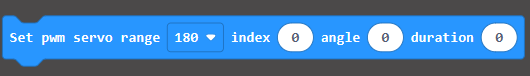</td>
      <td>Set PWM servo rotation and angle, and carry out central position calibration.</td>
    </tr>
    <tr>
      <td>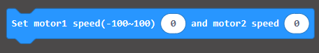</td>
      <td>Set the speed of motor 1 and motor 2. The value ranges -100 to 100. When it is 0, motor stop working.</td>
    </tr>
    <tr>
      <td></td>
      <td></td>
      <td>Delay coding block. Program will execute a specific program at setting time.</td>
    </tr>
  </tbody>
</table>

* **Block Coding Combination**

The value setting method is as follows:

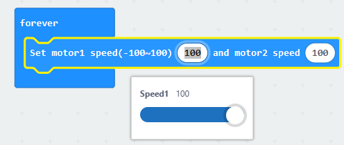

The program is as follows:

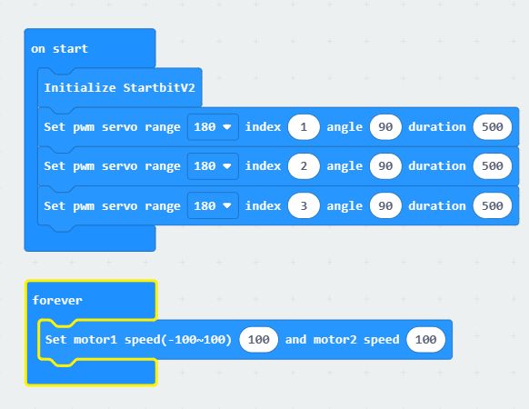

### 2.1.5 Project Outcome

Connect the micro:bit board only to your computer. After the program is transferred to micro:bit, insert it into the expansion board. Turn on micro:bit, and you will see Qtruck going forward.

## 2.2 Turning

### 2.2.1 Preparation

The motor ports on Qtruck are shown in the picture below. Please connect the motor cable to the motor port on the same side.

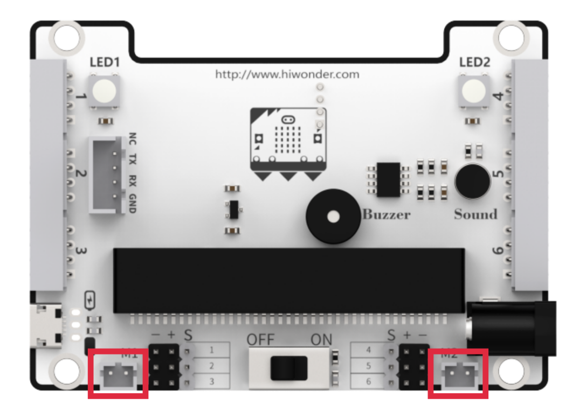

### 2.2.2 Learning Objective

(1) Learn about the logic of this feature and related block coding.

(2) Program Qtruck to turn.

### 2.2.3 Project Logic

There are two geared motors on Qtruck. Set the value of one of the servos to a negative value to implement turning.

For example, set the motor 2 speed to a negative number, Qtruck turns right.

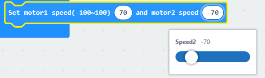

### 2.2.4 Program Writing

* **Extension Package adding method**

Online programming: click [https://makecode.microbit.org/]() to enter the programming interface. After creating a new project, click **Extensions** to add the Hiwonder software package for programming.

Add [https://github.com/Hiwonder/Startbit]() for micor:bit V1.5.

Add [https://github.com/Hiwonder/StartbitV2]() for micro:bit V2.0.

:::{Note}

Please select the expansion package corresponding to the version of micro:bit. The version of micro:bit can be viewed at the lower right corner of the board.

:::

* **Block Coding Learning**

<table border="1">
  <thead>
    <tr>
      <th>Coding Block</th>
      <th>Class</th>
      <th>Function</th>
    </tr>
  </thead>
  <tbody>
    <tr>
      <td></td>
      <td rowspan="2"></td>
      <td>Preparation for hardware device</td>
    </tr>
    <tr>
      <td></td>
      <td>Set the speed of motor 1 and motor 2. The value ranges -100 to 100. When it is 0, motor stop working.</td>
    </tr>
    <tr>
      <td></td>
      <td></td>
      <td>Delay coding block. Program will execute a specific program at setting time.</td>
    </tr>
  </tbody>
</table>

* **Block Coding Combination**

The program is as follows:

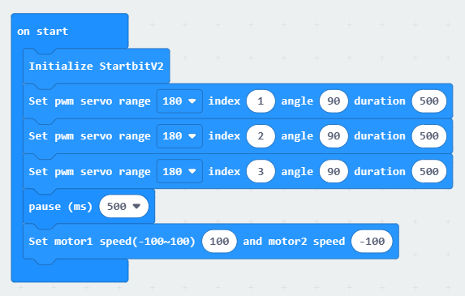

### 2.2.5 Project Outcome

Connect the micro:bit board only to your computer. After the program is transferred to micro:bit, insert it into the expansion board. When you place Qtruck on a flat surface and turn it on, Qtruck will turn right.

## 2.3 Driving

### 2.3.1 Preparation

The motor ports on Qtruck are shown in the picture below. Please connect the motor cable to the motor port on the same side.

### 2.3.2 Learning Objective

(1) Learn about the logic of this game and related block coding.

(2) Program Qtruck to realize driving.

### 2.3.3 Project Logic

By combining the motor's forward motion and turning, and setting pause durations, you can achieve a **"square path"** driving pattern.

### 2.3.4 Program Writing

* **Extension Package adding method**

Online programming: click [https://makecode.microbit.org/]() to enter the programming interface. After creating a new project, click **Extensions** to add the Hiwonder software package for programming.

Add [https://github.com/Hiwonder/Startbit]() for micor:bit V1.5.

Add [https://github.com/Hiwonder/StartbitV2]() for micro:bit V2.0.

:::{Note}

Please select the expansion package corresponding to the version of micro:bit. The version of micro:bit can be viewed at the lower right corner of the board.

:::

* **Block Coding Learning**

<table border="1">
  <thead>
    <tr>
      <th>Coding Block</th>
      <th>Class</th>
      <th>Function</th>
    </tr>
  </thead>
  <tbody>
    <tr>
      <td></td>
      <td></td>
      <td>Set the speed of motor 1 and motor 2. The value ranges -100 to 100, which can control Qtruck's movement.</td>
    </tr>
    <tr>
      <td></td>
      <td rowspan="2"></td>
      <td>If two inputs are True, the result is True.</td>
    </tr>
    <tr>
      <td>
        
        
      </td>
      <td>Create a variable and assign it as 0.</td>
    </tr>
  </tbody>
</table>

* **Block Coding**

The value setting method is as follows:

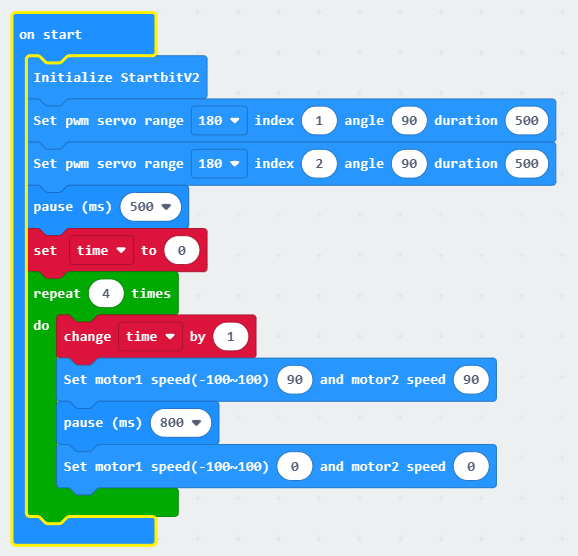

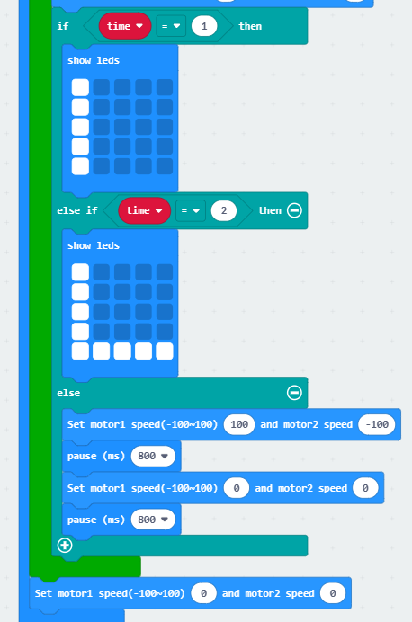

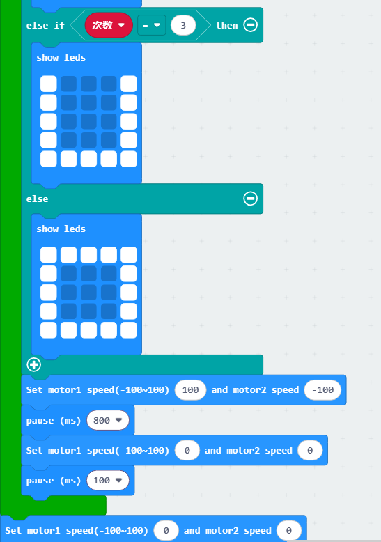

### 2.3.5 Project Outcome

Connect the micro:bit board only to your computer. After the program is transferred to micro:bit, insert it into the expansion board. Turn on Qtruck, it will go forward first, then turn left, and repeat this action four times.

## 2.4 Speed Adjustment

### 2.4.1 Preparation

The motor ports on Qtruck are shown in the picture below. Please connect the motor cable to the motor port on the same side.

### 2.4.2 Learning Objective

(1) Learn how to create variable.

(2) Program Qtruck to automatically adjust speed while driving.

### 2.4.3 Project Logic

There are two geared motors on Qtruck, you can control motor rotation by programming.

### 2.4.4 Program Writing

* **Extension Package adding method**

Online programming: click [https://makecode.microbit.org/]() to enter the programming interface. After creating a new project, click **Extensions** to add the Hiwonder software package for programming.

Add [https://github.com/Hiwonder/Startbit]() for micor:bit V1.5.

Add [https://github.com/Hiwonder/StartbitV2]() for micro:bit V2.0.

:::{Note}

Please select the expansion package corresponding to the version of micro:bit. The version of micro:bit can be viewed at the lower right corner of the board.

:::

* **Block Coding Learning**

<table border="1">
  <thead>
    <tr>
      <th>Coding Block</th>
      <th>Class</th>
      <th>Function</th>
    </tr>
  </thead>
  <tbody>
    <tr>
      <td></td>
      <td rowspan="2"></td>
      <td>Preparation for hardware device</td>
    </tr>
    <tr>
      <td></td>
      <td>Set the speed of motor 1 and motor 2. The value ranges -100 to 100. When it is 0, motor stop working.</td>
    </tr>
    <tr>
      <td></td>
      <td></td>
      <td>Delay coding block. Program will execute a specific program at setting time.</td>
    </tr>
  </tbody>
</table>

* **Block Coding Combination**

Create variables:

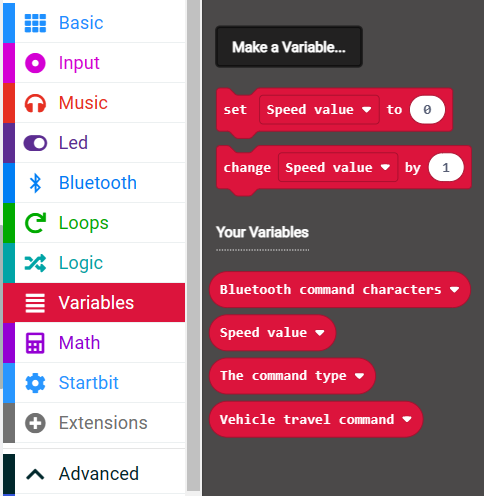

The program is as follows:

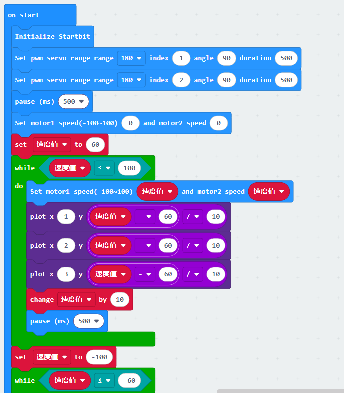

### 2.4.5 Project Outcome

Connect the micro:bit board to your computer. After the program is transferred to micro:bit, insert it into the expansion board. Turn on Qtruck, it will go forward at different speeds and go backward at different speeds, then stop moving.