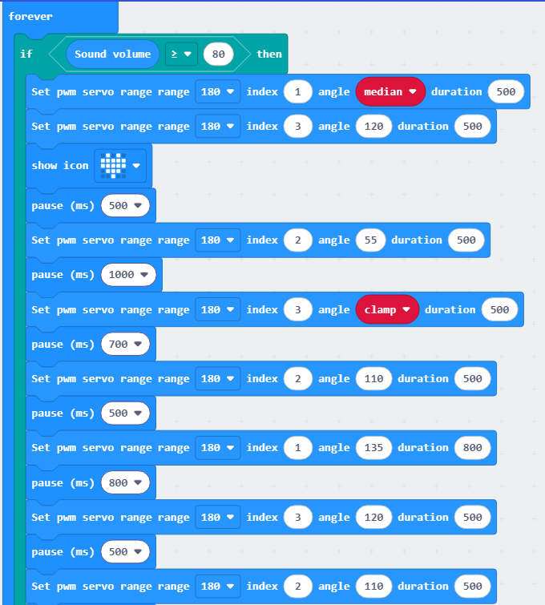

# 3. Smart Function Lesson

## 3.1 Intelligent Line Following

### 3.1.1 Preparation

(1) Connect 4-ch line follower to the port shown on below picture (Port No.4 of expansion board).

(2) Prepare a black line, not too wide.

### 3.1.2 Learning Objective

(1) Learn about the principle of 4-ch line follower and corresponding coding blocks.

(2) Program Qtruck to move along black line.

### 3.1.3 Project Logic

Use 4-channel line follower sensor to detect black and white lines, which enable Qtruck move along black line.

The sensor has four sensing units, and each unit includes an infrared emitter and an infrared receiver. If the infrared light is reflected, for example when it encounters a white or other light-colored surface, the receiver will receive the infrared signal, and you will see the corresponding blue LED indicator light up on the back of the line follower sensor. If the infrared light is absorbed or cannot be reflected, the receiver will not receive any signal.

If you find that line following does not work properly during use, you can adjust the sensor sensitivity with a screwdriver. Turning clockwise will increase the sensitivity, while turning counterclockwise will decrease it.

Sensitivity Adjustment Location

### 3.1.4 Program Writing

* **Extension Package Adding Method**

Online programming: click <https://makecode.microbit.org/> to enter the programming interface. After creating a new project, click **"Extensions"** to add Hiwonder software package for programming.

Add <https://github.com/Hiwonder/Startbit>for micor:bit V1.5.

Add <https://github.com/Hiwonder/StartbitV2> for micro:bit V2.0.

:::{Note}
Please select the expansion package corresponding to the version of micro:bit. The version of micro:bit can be viewed at the lower right corner of the board.
:::

* **Block Coding Learning**

| **Coding Block** |                              **Class**                              | **Function** |
|:--:|:-------------------------------------------------------------------:|:--:|
|  |   | Determine sensor status |
|  |   | If the condition is `True`, execute statement 1 (requires to add), otherwise, execute statement 2 (requires to add). |

* **Block Coding Combination**

### 3.1.5 Project Outcome

:::{Note}
For sensor sensitivity adjustment, please refer to the video in [Appendix->Robot Debug](Appendix.md).
:::

Connect micro:bit board only to your computer. After the program is transferred to micro:bit, insert it into expansion board. After turning on the switch, place the Qtruck robot on the laid-out black line. You will see the Qtruck move along the direction of the black line.

## 3.2 Line Following and Light up

### 3.2.1 Preparation

(1) Connect 4-ch line follower to the port shown on below picture (Port 4 of expansion board).

(2) Prepare your black line, not too wide.

### 3.2.2 Learning Objective

(1) Learn about the principle of 4-ch line follower.

(2) Program Qtruck to move along the black line and change RGB light color.

### 3.2.3 Project Logic

Use 4-channel line follower sensor to detect black and white lines, which enable Qtruck move along black line.

The sensor has four sensing units, and each unit includes an infrared emitter and an infrared receiver. If the infrared light is reflected, for example when it encounters a white or other light-colored surface, the receiver will receive the infrared signal, and you will see the corresponding blue LED indicator light up on the back of the line follower sensor. If the infrared light is absorbed or cannot be reflected, the receiver will not receive any signal.

If you find that line following does not work properly during use, you can adjust the sensor sensitivity with a screwdriver. Turning clockwise will increase the sensitivity, while turning counterclockwise will decrease it.

Sensitivity Adjustment Location

### 3.2.4 Program Writing

* **Extension Package Adding Method**

Online programming: click <https://makecode.microbit.org/> to enter the programming interface. After creating a new project, click **"Extensions"** to add Hiwonder software package for programming.

Add <https://github.com/Hiwonder/Startbit> for micor:bit V1.5.

Add <https://github.com/Hiwonder/StartbitV2> for micro:bit V2.0.

:::{Note}
Please select the expansion package corresponding to the version of micro:bit. The version of micro:bit can be viewed at the lower right corner of the board.
:::

* **Block Coding Learning**

| **Block Coding** |                                  **Class**                                   | **Function** |
|:--:|:----------------------------------------------------------------------------:|:--:|
|  |            | Set the serial number of light and its color. After setting is complete, use **"show light"** coding block to put the setting into effect. |
|  |            | Use with the above coding block to emit corresponding light color. |

* **Block Coding Combination**

### 3.2.5 Project Outcome

:::{Note}
For sensor sensitivity adjustment, please refer to the video in [Appendix->Robot Debug](Appendix.md).
:::

Connect micro:bit board only to your computer. After the program is transferred to micro:bit, insert it into expansion board. Turn on Qtruck, it will move along the black line, then RGB light will regularly change color.

## 3.3 Intelligent Voice Control

### 3.3.1 Preparation

(1) The location of the sound sensor on the Qtruck robot.

(2) The distribution and placement of the servos on the Qtruck.

(3) Prepare a small block.

### 3.3.2 Learning Objective

(1) Gain a basic understanding of the sound sensor and servos.

(2) Learn how to use logic instruction blocks.

(3) Program the Qtruck robot to grab objects upon hearing a sound.

### 3.3.3 Project Logic

Qtruck is equipped with a sound sensor that can detect sound volume levels. By programming, we control the three servos on the robotic arm to perform a grabbing action.

The sound sensor functions similarly to a microphone. It is used to receive sound waves, but it cannot be used to measure noise intensity.

A servo can precisely control the rotation angle of its horn, which is why it is often used in mechanical systems that require high accuracy. A servo typically consists of a motor, control circuit board, gear set, and potentiometer.

### 3.3.4 Program Writing

* **Extension Package Adding Method**

Online programming: click <https://makecode.microbit.org/> to enter the programming interface. After creating a new project, click **"Extensions"** to add Hiwonder software package for programming.

Add <https://github.com/Hiwonder/Startbit> for micor:bit V1.5.

Add <https://github.com/Hiwonder/StartbitV2> for micro:bit V2.0.

:::{Note}
Please select the expansion package corresponding to the version of micro:bit. The version of micro:bit can be viewed at the lower right corner of the back of the board.
:::

* **Block Coding Learning**

|                            **Block Coding**                            |                             **Class**                              | **Function** |
|:----------------------------------------------------------------------:|:------------------------------------------------------------------:|:--:|
|     |  | You can set the rotation angle and range for servos 1 to 8. |
|     |  | Obtain the volume level detected by the sound sensor, ranging from `0` to `255`. |
|  | | If the specified condition is met, the statement will be executed (to be defined by the user). |

* **Block Coding Combination**

The program is as follow:

The **"Sound volume"** value in the program can be adjusted according to actual conditions.

### 3.3.5 Project Outcome

:::{Note}
For better results, please operate in a quiet environment. Also, do not use the robotic arm to pick up objects weighing more than 50 grams. If the robotic arm shows abnormal movements or positions after being powered on, please refer to [Appendix -\> Robot Debug](Appendix.md) to watch the instructional video.
:::

Insert the micro:bit controller into the computer separately, download the program, and then insert it into the expansion board. After turning on the switch, you can control the robotic arm by clapping your hands. When you clap once, the robotic arm will pick up the block placed in front of it.

## 3.4 Grab in a Certain Distance

### 3.4.1 Preparation

(1) Connect ultrasonic sensor to port 2 of expansion board.

(2) The position of servos on Qtruck.

(3) Prepare a square block.

### 3.4.2 Learning Objective

(1) Learn about the principle of ultrasonic sensor.

(2) Learn about the coding block related to ultrasonic sensor.

(3) Enable Qtruck to grab object in a certain distance through programming.

### 3.4.3 Project Logic

The ultrasonic sensor is used to measure distance, and the position of the object in front is determined through programming. If the conditions are met, the robotic arm will proceed to pick up the object.

The ultrasonic sensor is equipped with two transducers, one for transmitting and one for receiving ultrasonic waves. When measuring distance, the module automatically emits eight 40 kHz square wave pulses to detect whether an echo is returned. If an echo is detected, the sensor outputs a high-level signal. The duration of this high-level signal corresponds to the time it takes for the ultrasonic waves to travel to the object and bounce back.

Formula: measured distance = (the duration of high level * sound velocity (`340M/S`)) / `2`

### 3.4.4 Program Writing

* **Extension Package Adding Method**

Online programming: click <https://makecode.microbit.org/> to enter the programming interface. After creating a new project, click **"Extensions"** to add Hiwonder software package for programming.

Add <https://github.com/Hiwonder/Startbit> for micor:bit V1.5.

Add <https://github.com/Hiwonder/StartbitV2> for micro:bit V2.0.

:::{Note}
Please select the expansion package corresponding to the version of micro:bit. The version of micro:bit can be viewed at the lower right corner of the board.
:::

* **Block Coding Learning**

| **Block Coding** |                              **Class**                               | **Function** |
|:--:|:--------------------------------------------------------------------:|:--:|
|  |   | Create a variable named `distance` and assign it a value of `0`. |
|  |   | Get the distance of the ahead object. |
|  |  | If two inputs are `True`, the result will be `True`. |

* **Block Coding Combination**

### 3.4.5 Project Outcome

:::{Note}
Do not use the robotic arm to pick up objects weighing more than 50 grams. Additionally, if the robotic arm shows abnormal movements or positions after being powered on, please refer to [Appendix->Robot Debug](Appendix.md) to watch the instructional video.
:::

Connect micro:bit board only to your computer. After the program is transferred to micro:bit, turn on Qtruck, then you will see Qtruck keeps still. After putting a block in front of ultrasonic sensor, Qtruck will grab and place it at a side.

## 3.5 Obstacle Clearance

### 3.5.1 Preparation

(1) Connect ultrasonic sensor to port 2 of expansion board.

(2) The position of servos on Qtruck.

(3) Prepare several blocks.

### 3.5.2 Learning Objective

(1) Learn about the principle of the feature.

(2) Understand and be able to use Boolean instruction blocks in the **"Logic"** category.

(3) Enable Qtruck to automatically determine the ahead object on a specific path and carry it to the corresponding position through programming.

### 3.5.3 Project Logic

Set Qtruck to go forward and use ultrasonic sensor to detect distance. When the distance is less than a certain value, it is determined that an obstacle is encountered in front of it, and then the obstacle will be picked up and moved out of the way, and then it will continue to move forward.

### 3.5.4 Program Writing

* **Extension Package Adding Method**

Online programming: click <https://makecode.microbit.org/> to enter the programming interface. After creating a new project, click **"Extensions"** to add Hiwonder software package for programming.

Add <https://github.com/Hiwonder/Startbit> for micor:bit V1.5.

Add <https://github.com/Hiwonder/StartbitV2> for micro:bit V2.0.

:::{Note}
Please select the expansion package corresponding to the version of micro:bit. The version of micro:bit can be viewed at the lower right corner of the board.
:::

* **Block Coding Learning**

| **Block Coding** |                              **Class**                               | **Function** |
|:--:|:--------------------------------------------------------------------:|:--:|
|  |   | Set the speed of `motor 1` and `motor 2`. from `-100` to `100`, which can control Qtruck to go forward or turn. |
|  |   | If two inputs are `True`, the result will be `True`. |

* **Block Coding Combination**

**"Distance"** in program can be modified according to actual situation.

### 3.5.5 Project Outcome

:::{Note}
Do not use the robotic arm to pick up objects weighing more than 50 grams. Additionally, if the robotic arm shows abnormal movements or positions after being powered on, please refer to [Appendix->Robot Debug](Appendix.md) to watch the instructional video.
:::

Connect micro:bit board only to your computer. After the program is transferred to micro:bit, insert it into expansion board. Turn on Qtruck, then it will go forward. When encounter an obstacle, it will clear it out of its way and keep moving.

## 3.6 Line Following and Obstacle Clearance

### 3.6.1 Preparation

(1) The location of the ultrasonic sensor on the Qtruck robot, port 2 of the expansion board.

(2) Distribution of the servo IDs on the robotic arm.

(3) Prepare a black line, not too thin or too wide, and a small block.

### 3.6.2 Learning Objective

(1) Understand the principle of this feature.

(2) Program the Qtruck to detect obstacles while line following and transport the detected obstacle to a designated area.

### 3.6.3 Project Logic

Configure the Qtruck robot to perform line following. While following the line, use the ultrasonic sensor to detect distance. When the detected distance is within the set threshold, it determines that there is an obstacle ahead. At this stage, the robot will pick up and remove the obstacle. After completing this action, it will continue line following.

### 3.6.4 Program Writing

* **Extension Package Adding Method**

Online programming: click <https://makecode.microbit.org/> to enter the programming interface. After creating a new project, click **"Extensions"** to add Hiwonder software package for programming.

Add <https://github.com/Hiwonder/Startbit> for micor:bit V1.5.

Add <https://github.com/Hiwonder/StartbitV2> for micro:bit V2.0.

:::{Note}
Please select the expansion package corresponding to the version of micro:bit. The version of micro:bit can be viewed at the lower right corner of the back of the board.
:::

* **Block Coding Learning**

<table border="1" class="docutils">
<colgroup><col style="width: 20%;"><col style="width: 20%;"><col style="width: 60%;"></colgroup>
<thead>
<tr>
<th style="text-align: center;"><strong>Block Coding</strong></th>
<th style="text-align: center;"><strong>Class</strong></th>
<th style="text-align: center;"><strong>Function</strong></th>
</tr>
</thead>
<tbody>
<tr>
<td style="text-align: center;"></td>
<td style="text-align: center;"></td>
<td style="text-align: center;">Initialize the hardware devices.</td>
</tr>
<tr>
<td style="text-align: center;"></td>
<td style="text-align: center;"></td>
<td style="text-align: center;">When powered on, the contents here will be executed first.</td>
</tr>
<tr>
<td style="text-align: center;"></td>
<td style="text-align: center;"></td>
<td style="text-align: center;">Set the speed of <code>Motor 1</code> and <code>Motor 2</code>, with a range from <code>-100</code> to <code>100</code>, to control the robot's forward movement and turning. A positive value makes the motor rotate forward, and a negative value makes it rotate backward. When set to <code>0</code>, the motor stops rotating.</td>
</tr>
<tr>
<td style="text-align: center;"></td>
<td style="text-align: center;"></td>
<td style="text-align: center;">Control the rotation range, angle, and running time of the specified servo.</td>
</tr>
<tr>
<td style="text-align: center;"></td>
<td style="text-align: center;"></td>
<td style="text-align: center;">Turn on specific LEDs on the micro:bit's LED matrix.</td>
</tr>
<tr>
<td style="text-align: center;"></td>
<td style="text-align: center;"></td>
<td style="text-align: center;">Delay block, which makes the program wait for a set time before continuing.</td>
</tr>
<tr>
<td style="text-align: center;"></td>
<td style="text-align: center;"></td>
<td style="text-align: center;">If both inputs are <code>True</code>, the result will be <code>True</code>.</td>
</tr>
<tr>
<td style="text-align: center;"></td>
<td style="text-align: center;"></td>
<td style="text-align: center;">Define a custom variable.</td>
</tr>
<tr>
<td style="text-align: center;"></td>
<td style="text-align: center;"></td>
<td style="text-align: center;">Set the value of a variable.</td>
</tr>
</tbody>
</table>

* **Block Coding Combination**

The program is as follow:

### 3.6.5 Project Outcome

:::{Note}
If the line-following performance is not optimal, please adjust the sensitivity of the sensors. You can also visit [Appendix->Robot Debug](Appendix.md) to watch related instruction videos.
:::

Insert the micro:bit controller into the computer separately, download the program, and then insert it into the expansion board. After turning on the switch, you will see the Qtruck robot start line following. When the robot encounters an obstacle during the feature, it will stop, pick up and remove the obstacle, and then continue line following.