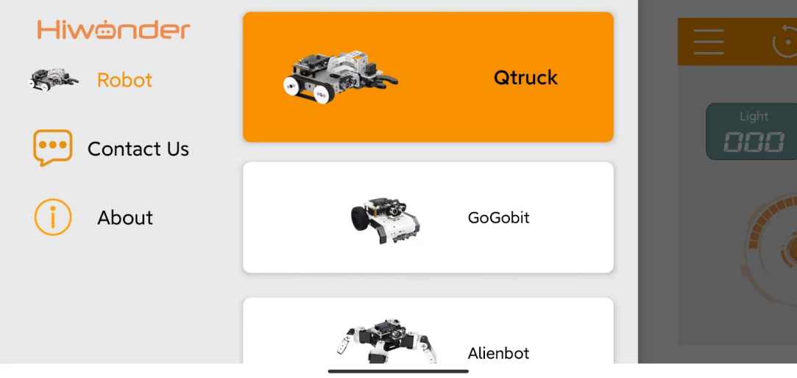
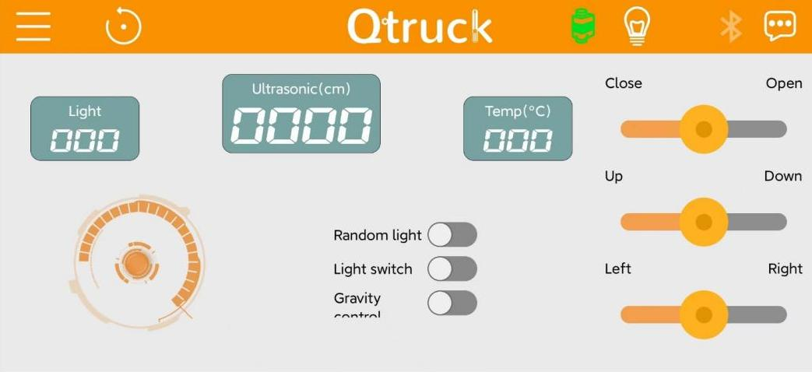
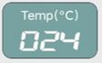
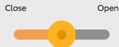

# 4. Remote Control Lesson

## 4.1 Quick Program Download Method

(1) In this folder, find the [Qtruck-Bluetooth Control.hex](../_static/source_code/Bluetooth_Control_program.zip) program file. Right-click on it or press `Ctrl+C` to copy the program.

(2) After copying, paste it into the micro:bit drive.

(3) The copy action is the download process. Once the download is complete, the hex file will disappear from the drive, and the drive will automatically eject.

You can also observe the yellow indicator light near the USB port on the micro:bit controller. During downloading, the light will flash rapidly.

:::{Note}
When the download is complete, it will stop flashing and stay on steadily.
:::

After the download is complete, the hex file will disappear from the micro:bit drive. Once powered, the program will run automatically.

Indicator light status after download (left) and successful program download confirmation (right)

No hex file visible in the drive after download is complete

## 4.2 APP Control

### 4.2.1 Introduction to microbit V2.0

Based on the original function of micro:bit V1.5, the new generation of micro:bit V2.0 has been optimized and improved in computing power and performance, as well as add several onboard modules for expansion.

All functions of micro:bit V1.5 can be implemented in micro:bit V2. Therefore, the tutorial for micro:bit V1.5 is applicable to micro:bit V2.0.

Regarding the new features of micro:bit V2.0, please see the related lessons.

The following table shows the comparison between two boards and the red parts highlights the new function of micro:bit V2.0.

<!DOCTYPE html>
<html lang="en">
<head>
    <meta charset="UTF-8">
    <meta name="viewport" content="width=device-width, initial-scale=1.0">
    <title>micro:bit V1.5 vs V2 Comparison</title>
    
</head>
<body>
    <table>
        <caption>micro:bit V1.5 vs V2 Comparison</caption>
        <thead>
            <tr>
                <th>No.</th>
                <th>Feature</th>
                <th>micro:bit V1.5</th>
                <th>micro:bit V2</th>
            </tr>
        </thead>
        <tbody>
            <tr>
                <td>1</td>
                <td>Appearance</td>
                <td>
                    

                        

                            
                            
Front

                        

                        

                            
                            
Back

                        

                    

                </td>
                <td>
                    

                        

                            
                            
Front

                        

                        

                             
                            
Back

                        

                    

                </td>
            </tr>
            <tr>
                <td>2</td>
                <td>Processor</td>
                <td>Nordic nRF51822</td>
                <td>Nordic nRF52833</td>
            </tr>
            <tr>
                <td>3</td>
                <td>ARM</td>
                <td>Cortex-M0 32bit 16MHz</td>
                <td>Cortex-M4 32bit+FPU 64MHz</td>
            </tr>
            <tr>
                <td>4</td>
                <td>Memory/Flash</td>
                <td>16KB RAM/256KB Flash</td>
                <td>128KB RAM/512KB Flash</td>
            </tr>
            <tr>
                <td>5</td>
                <td>Touch Logo</td>
                <td>None</td>
                <td>Onboard touch sensor</td>
            </tr>
            <tr>
                <td>6</td>
                <td>Microphone</td>
                <td>None</td>
                <td>Onboard microphone with LED indicator</td>
            </tr>
            <tr>
                <td>7</td>
                <td>Speaker</td>
                <td>None</td>
                <td>Onboard electromagnetic speaker</td>
            </tr>
            <tr>
                <td>8</td>
                <td>Edge Connector</td>
                <td>Flat type</td>
                <td>Gear type</td>
            </tr>
            <tr>
                <td>9</td>
                <td>Reset Button</td>
                <td>Reset function</td>
                <td>Reset function, long press for power saving mode</td>
            </tr>
            <tr>
                <td>10</td>
                <td>Power Indicator</td>
                <td>None</td>
                <td>Red LED when powered</td>
            </tr>
            <tr>
                <td>11</td>
                <td>Bluetooth</td>
                <td>Bluetooth 4.0</td>
                <td>Bluetooth 5.0</td>
            </tr>
            <tr>
                <td>12</td>
                <td>Operating Current</td>
                <td>90mA</td>
                <td>300mA</td>
            </tr>
        </tbody>
    </table>
</body>
</html>

### 4.2.2 APP Control

:::{Note}
This lesson takes iOS system as example and is also applicable to Android system.
:::

iOS user can directly search and download **"Wonderbit"** in APP Store.

* **Program Download**

(1) Please find [Qtruck-Bluetooth control.hex](../_static/source_code/Bluetooth_Control_program.zip) program under folder **"APP Control Program"**.

(2) Copy the program to micro:bit disk.

(3) After downloading, hex file is not visible in disk drive and the disk drive will automatically flash out. Also, you can see that the indicator next to USB port emits yellow light. The indicator will blink rapidly and continuously while your program is transferred and will stop flashing and keep on after transfer is complete.

:::{Note}
After transfer is complete, hex file will disappear in micro:bit disk. After power on micro:bit, your program starts running on your micro:bit automatically.
:::

* **Install APP**

Find and transfer [Wonderbit.apk](https://play.google.com/store/apps/details?id=com.hiwonder.wonderbit) installation package (only for Android user) to your phone. Download apk file on your phone and install app.

* **Connect to APP**

:::{Note}
*   Before using app, please enable Bluetooth and GPS service in phone settings.
*   Click Bluetooth button on app to pair with robot. Do not connect robot by Bluetooth in your phone settings.

:::

(1) Enable Bluetooth and GPS service.

(2) Open Wonderbit. Click on  to select **"Qtruck"**.

(3) Click on  and select **"BBC micro:bit"** in pop-up device search list to connect.

(4) At the same time, keep your phone close to Qtruck. After connection is complete, Bluetooth icon on app will stop flashing and light up.

* **App Control**

There are two functions on home interface of app including color light and servo control functions.

First of all, please learn about the color light function.

| **Icon** | **Function** |
| :--: | :--: |
|  | Control Qtruck to go forward or backward and turn left or right. |
|  | Display light intensity of environment where Qtruck is located. |
|  | Display the distance between Qtruck and object ahead. |
|  | Display temperature of environment where Qtruck is located. |
|  | Turn on this button, two color light on Qtruck emit random light (the light color is contained in surroundings). |
|  | Turn on or off the color light. |
|  | Turn on Gravity control, you can tilt your phone to control Qtruck to move. |
|  | Control Qtruck's light color. |
|  | Click this button to open servo control interface. |

The home interface of servo control is as follow.

| **Icon** | **Function** |
| :--: | :--: |
|  | Control `ID3` servo, i.e., gripper. |
|  | Control `ID2` servo, i.e., the middle part of robotic arm. |
|  | Control `ID3` servo, i.e., the distal part of robotic arm. |