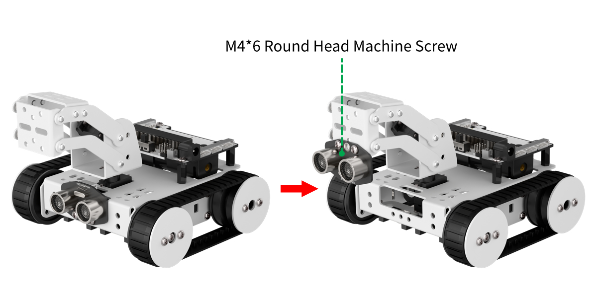
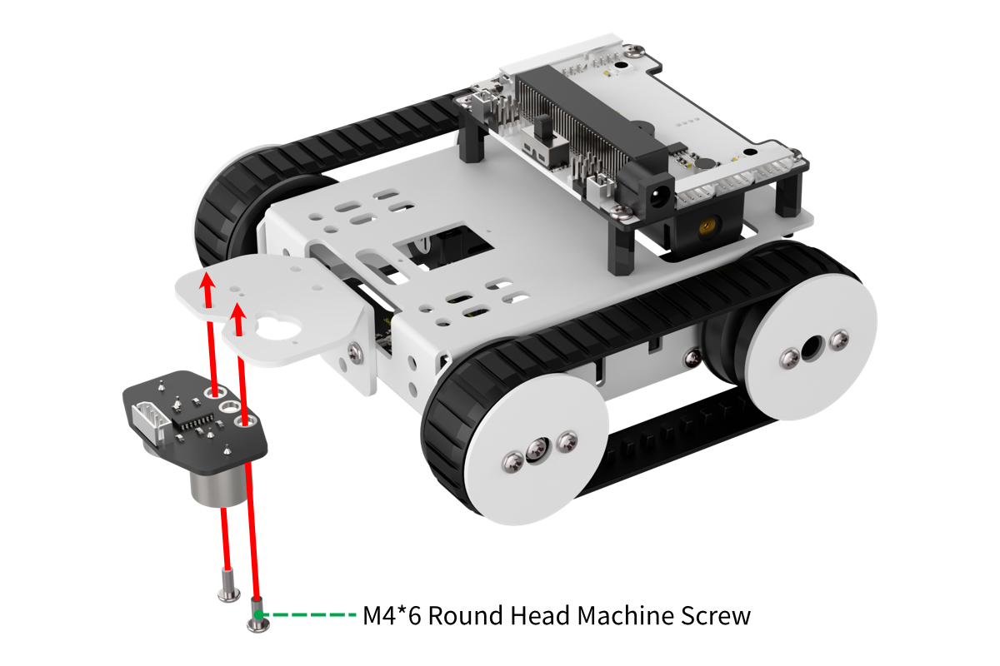
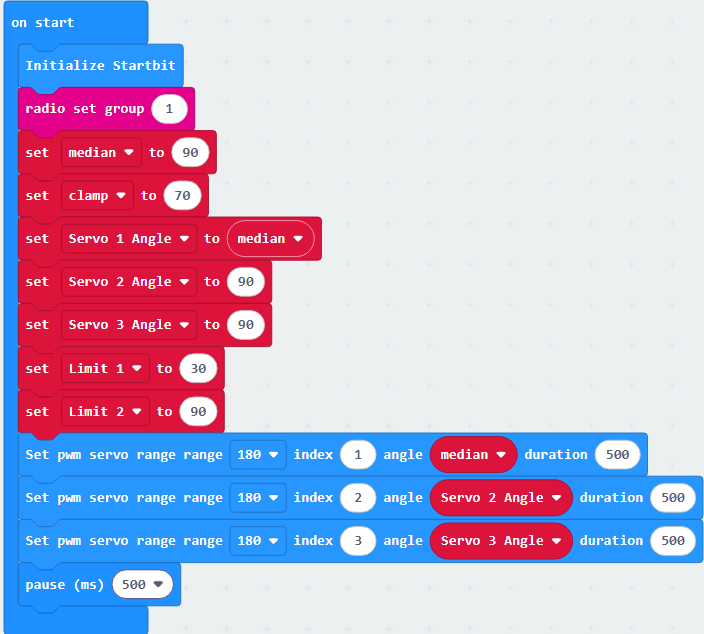

# 5. Advanced Function Lesson

## 5.1 Obstacle Avoidance Robot

### 5.1.1 Obstacle Avoidance Robot Assembly

Figure 1 Obstacle Avoidance Robot Diagram

:::{Note}
When assembling the patrol mode, you can remove the main structure as shown above, and then install the ultrasonic sensor onto the robotic arm.
:::

* **Step 1: Assemble ultrasonic sensor**

* **Step 2:Connect ultrasonic sensor to port 2 of micro:bit expansion board**

### 5.1.2 Hand Chasing

* **Preparation**

(1) Connect ultrasonic sensor to port 2 of expansion board.

(2) The connection port of motors. Connect motor cable to the motor port on the same side as motor.

* **Learning Objective**

(1) Learn about the creation and assignment of variables, as well as the use of Boolean instruction blocks.

(2) Program Qtruck to achieve an intelligent following effect.

* **Project Logic**

When the distance is greater than the value set in program between Qtruck and hand, Qtruck moves closer to hand at certain speed. When it is less than 15cm, it will move away from hand at a certain speed.

The ultrasonic sensor is equipped with two transducers, one for transmitting and one for receiving ultrasonic waves. When measuring distance, the module automatically emits eight 40 kHz square wave pulses to detect whether an echo is returned. If an echo is detected, the sensor outputs a high-level signal. The duration of this high-level signal corresponds to the time it takes for the ultrasonic waves to travel to the object and bounce back.

Formula: measured distance= (the duration of high level\*sound velocity(340M/S))/2

* **Program Writing**

(1) Extension Package Adding Method

Online programming: click <https://makecode.microbit.org/> to enter the programming interface. After creating a new project, click **"Extensions"** to add Hiwonder software package for programming.

Add <https://github.com/Hiwonder/Startbit> for micor:bit V1.5.

Add <https://github.com/Hiwonder/StartbitV2> for micro:bit V2.0.

:::{Note}
Please select the expansion package corresponding to the version of micro:bit. The version of micro:bit can be viewed at the lower right corner of the back of the board.
:::

(2) Coding Block Learning

| **Coding Block** |                                      **Class**                                       | **Function** |
|:--:|:------------------------------------------------------------------------------------:|:--:|
|  |                      | Create a variable named `distance` and assign a value of 0. |
|  |  | Obtain the distance between ultrasonic sensor and obstacle. |
|  |                     | If two inputs are True, the result is True. |

(3) Coding Block Combination

:::{Note}
The value of **"distance"** in program can be adjusted according to the actual situation.
:::

* **Project Outcome**

Connect micro:bit board only to your computer. After the program is transferred to micro:bit, insert it into expansion board. Turn on Qtruck and place your hand in front of ultrasonic sensor. When move your hand away from Qtruck, it goes forward. When move your hand close to it, it goes backward.

### 5.1.3 Cross Maze

* **Preparation**

(1) Connect ultrasonic sensor to port 2 of expansion board.

(2) The position of servos on Qtruck.

* **Learning Objective**

(1) Learn about the ultrasonic sensor and grasp the corresponding coding block.

(2) Program Qtruck to implement intelligent obstacle avoidance.

* **Project Logic**

Ultrasonic sensor can measure distances in different directions. When the measured distance is less than the set value, Qtruck will stop. Then detect the distance between the left and right sides. By comparing the distance between two sides, Qtruck will turn and continue to move forward.

The ultrasonic sensor is equipped with two transducers, one for transmitting and one for receiving ultrasonic waves. When measuring distance, the module automatically emits eight 40 kHz square wave pulses to detect whether an echo is returned. If an echo is detected, the sensor outputs a high-level signal. The duration of this high-level signal corresponds to the time it takes for the ultrasonic waves to travel to the object and bounce back.

Formula: measured distance= (the duration of high level\*sound velocity(340M/S))/2

* **Program Writing**

(1) Extension Package Adding Method

Online programming: click <https://makecode.microbit.org/> to enter the programming interface. After creating a new project, click **"Extensions"** to add Hiwonder software package for programming.

Add <https://github.com/Hiwonder/Startbit> for micor:bit V1.5.

Add <https://github.com/Hiwonder/StartbitV2> for micro:bit V2.0.

:::{Note}
Please select the expansion package corresponding to the version of micro:bit. The version of micro:bit can be viewed at the lower right corner of the back of the board.
:::

(2) Coding Block Learning

| **Coding block** | **Class** | **Function** |
|:--:|:---|:--:|
|  |  | Set the rotation angle and range of servo 1 to 8. |
|  |  | If meeting the judgement condition, statement is executed. |

(3) Coding Block Combination

:::{Note}
The value of **"distance"** in program can be adjusted according to the actual situation.
:::

* **Project Outcome**

Connect micro:bit board only to your computer. After the program is transferred to micro:bit, insert it into expansion board. Turn on Qtruck, and it will stop when encounter an obstacle, then detect and compare the distance between left and right sides. Finally, Qtruck will make a turn in the direction of the greater distance and then move forward.

### 5.1.4 Obstacle Detection

* **Preparation**

(1) Connect ultrasonic sensor to port No.2 of expansion board.

(2) Prepare a small carton box

* **Learning Objective**

(1) Learn about the principle of ultrasonic sensor and coding blocks.

(2) Learn the coding blocks of music.

(3) Program Qtruck to turn implement intelligent turning.

* **Project Logic**

Program Qtruck to find the nearest obstacle and then turn its head in the corresponding direction.

The ultrasonic sensor is equipped with two transducers, one for transmitting and one for receiving ultrasonic waves. When measuring distance, the module automatically emits eight 40 kHz square wave pulses to detect whether an echo is returned. If an echo is detected, the sensor outputs a high-level signal. The duration of this high-level signal corresponds to the time it takes for the ultrasonic waves to travel to the object and bounce back.

Formula: measured distance= (the duration of high level\*sound velocity(340M/S))/2

* **Program Writing**

(1) Extension Package Adding Method

Online programming: click <https://makecode.microbit.org/> to enter the programming interface. After creating a new project, click **"Extensions"** to add Hiwonder software package for programming.

Add <https://github.com/Hiwonder/Startbit> for micor:bit V1.5.

Add <https://github.com/Hiwonder/StartbitV2> for micro:bit V2.0.

:::{Note}
Please select the expansion package corresponding to the version of micro:bit. The version of micro:bit can be viewed at the lower right corner of the back of the board.
:::

(2) Coding Block Learning

<table class="docutils-nobg" border="1">
  <thead>
    <tr>
      <th>Coding Block</th>
      <th>Class</th>
      <th>Function</th>
    </tr>
  </thead>
  <tbody>
    <tr>
      <td></td>
      <td rowspan="3"></td>
      <td>Obtain the distance between ultrasonic sensor and obstacle.</td>
    </tr>
    <tr>
      <td></td>
      <td>Set the rotation angle and range of servo 1 to 8.</td>
    </tr>
    <tr>
      <td></td>
      <td>Set the speed of motor 1 and 2 ranging -100 and 100 to control Qtruck's movement. When it is 0, motor stops working.</td>
    </tr>
    <tr>
      <td></td>
      <td></td>
      <td>Play a sound.</td>
    </tr>
  </tbody>
</table>

(3) Coding Block Combination

The setting of music coding block:

The program is shown below:

:::{Note}
The **"distance"**, **"variable value"** and **"angle"** can be modified according the actual situation.
:::

* **Project Outcome**

Connect micro:bit board only to your computer. After the program is transferred to micro:bit, insert it into expansion board. Turn on Qtruck, and it will find the nearest obstacle and turn its head towards the obstacle.

## 5.2 Balancing Robot

### 5.2.1 Balancing Robot Assembly

:::{Note}
When you assemble Qtruck to a balancing pose, you can directly remove the gripper and ultrasonic sensor from transportation robot's primary pose, as the picture shown above.
:::

### 5.2.2 Robotic Arm Balance Control

* **Preparation**

The position of Accelerometer on micro:bit board, as the picture shown below:

* **Learning Objective**

(1) Learn about the working principle of accelerometer.

(2) Program Qtruck to achieve robotic arm self-balancing while tilting the body.

* **Project Logic**

The angle detection of the accelerometer is used to detect the current status of the Qtruck, and the angle value obtained from the detection is superimposed on the servo angle of the balance state to achieve the balance control of the robotic arm.

When the micro:bit is stationary or moving at a constant speed, the accelerometer only detects gravitational acceleration. If the micro:bit is shaken lightly, the acceleration from the shake is much smaller than gravitational acceleration and can be ignored. Therefore, when using the micro:bit, the primary focus is on detecting changes in gravitational acceleration along the x, y, and z axes as the device's orientation changes, and applying this data accordingly.

* **Program Writing**

(1) Extension Package Adding Method

Online programming: click <https://makecode.microbit.org/> to enter the programming interface. After creating a new project, click **"Extensions"** to add Hiwonder software package for programming.

Add <https://github.com/Hiwonder/Startbit> for micor:bit V1.5.

Add <https://github.com/Hiwonder/StartbitV2> for micro:bit V2.0.

:::{Note}
Please select the expansion package corresponding to the version of micro:bit. The version of micro:bit can be viewed at the lower right corner of the back of the board.
:::

(2) Coding Block Learning

| **Coding Block** | **Class** | **Function** |
|:--:|----|:---|
|  |  | Obtain the rotation angle detected by accelerator |
|  |  | The values are rounded according to the numerical modification rules rounding. |

(3) Coding Block Combination

* **Project Outcome**

Connect micro:bit board only to your computer. After the program is transferred to micro:bit, insert it into expansion board. Turn on Qtruck, when it detects that the body is flipping forward and backward, it drives robotic arm to maintain a balancing pose.

## 5.3 Way-exploring Robot

### 5.3.1 Way-exploring Robot Assembly

Figure 1 Way-exploring Robot Diagram

:::{Note}
To set up the Way-exploring mode, first disassemble the main structure as shown above, then follow the steps below to install the components.
:::

* **Step 1: Install the claw bracket.**

Figure 2 Diagram of claw bracket installation

(1) Install ultrasonic sensor.

Figure 3 Diagram of ultrasonic sensor installation

### 5.3.2 Falling Detection

* **Preparation**

The position where ultrasonic sensor is assembled, connecting ultrasonic sensor to port 2 of expansion board.

* **Learning Objective**

(1) Learn about the ultrasonic sensor and its working principle, and understand how obstacle avoidance is achieved.

(2) Master the use of ultrasonic-related instruction blocks, and program Qtruck to achieve self-protection.

* **Project Logic**

Use ultrasonic sensor to detect distance and recognize the edge ahead based on the measured distance to prevent the robot from falling.

The ultrasonic sensor is equipped with two transducers, one for transmitting and one for receiving ultrasonic waves. When measuring distance, the module automatically emits eight 40 kHz square wave pulses to detect whether an echo is returned. If an echo is detected, the sensor outputs a high-level signal. The duration of this high-level signal corresponds to the time it takes for the ultrasonic waves to travel to the object and bounce back.

Formula: measured distance= (the duration of high level\*sound velocity(340M/S))/2

* **Program Writing**

(1) Extension Package Adding Method

Online programming: click <https://makecode.microbit.org/> to enter the programming interface. After creating a new project, click **"Extensions"** to add Hiwonder software package for programming.

Add <https://github.com/Hiwonder/Startbit> for micor:bit V1.5.

Add <https://github.com/Hiwonder/StartbitV2> for micro:bit V2.0.

:::{Note}
Please select the expansion package corresponding to the version of micro:bit. The version of micro:bit can be viewed at the lower right corner of the back of the board.
:::

(2) Coding Block Learning

| **Coding Block** | **Class** | **Function** |
|:--:|----|:---|
|  |  | Obtain the rotation angle detected by accelerator |
|  |  | The values are rounded according to the numerical modification rules rounding. |

(3) Coding Block Combination

:::{Note}
**"Distance"** in program can be modified according to actual situation.
:::

* **Project Outcome**

:::{Note}
Please keep your eyes on robot when start the feature. You need to hold the robot immediately if it falls.
:::

Connect micro:bit board only to your computer. After the program is transferred to micro:bit, insert it into expansion board. Turn on Qtruck and place it on a round table, then it will detect the edge of table. Once the detected distance get larger abruptly, Qtruck will move back.

## 5.4 microbit Lesson

### 5.4.1 Introduction to micro:bit

* **Introduction**

Being led by a well-known English TV station BBC, Microbit is jointly developed by Microsoft, Samsung, ARM and Lancaster University, UK, which gears to adolescents' programming education. As you can see, the size of micro:bit merely accounts for half of the bank card. Although the size is small, many rich functional electronic modules have been well equipped on it. From a technical perspective, the micro:bit development board is essentially a microcontroller based on the ARM architecture. In terms of features, this board is very suitable for beginners, especially elementary and middle school students. It is easy to program, supports block-based coding, and also offers options for JavaScript, Python, and other programming languages.

* **Control System Diagram**

:::{Note}
As shown in the figure below, it mainly consists of onboard modules including an accelerometer, programmable buttons, pins, LED matrix, USB port, Bluetooth, radio, and an electronic compass.
:::

(1) The front side of micro:bit board:

(2) The back side of micro:bit board:

* **Introduction to Module Function**

(1) Bluetooth antennas: micro:bit has nRF51822 processor and comes with Bluetooth 5.0 and 2.4G Hz RF antennas. Bluetooth is used to send signal to communicate between app and micro:bit, which can download program or connect to micro:bit.

(2) Compass and accelerometer: The accelerator and compass are combine in a module. micro:bit adopts Freescale `MMA8653FC` three axes (X,Y, Z) accelerometer. Acceleration describes how quickly an object's velocity changes. By measuring the acceleration caused by gravity, this module is designed to measure and calculate related physical quantities. In the micro:bit, it is mainly used to detect changes in gravitational acceleration along the three axes.

The electronic compass, also known as a magnetometer, can detect the strength of the Earth's magnetic field and also function as a digital compass to determine direction. It is an important component of an Attitude and Heading Reference System (AHRS).

(3) 5\*5 programmable LED dot matrix: Equipped with a 5\*5 LED dot matrix, micro:bit is able to display preset or custom numbers, English characters or simple graphics.

(4) Programmable Buttons: With two programmable buttons, micro:bit can execute the corresponding operation by pressing button, which is customizable.

### 5.4.2 Breathing Light

* **Preparation**

The position of dot matrix on micro:bit board, as the picture shown below:

* **Learning Objective**

(1) Learn about micro:bit dot matrix and related coding blocks.

(2) Program Qtruck to implement gradient pattern on micro:bit.

* **Project Logic**

Equipped with a 5\*5 LED dot matrix, micro:bit is able to display preset or custom numbers, English characters or simple graphics.

* **Program Writing**

(1) Coding Block Learning

| **Coding block** | **Class** | **Function** |
|:--:|:--:|:--:|
|  |  | Display the set pattern. |
|  |  | Obtain the brightness of display from 0 to 225. |
|  |  | If the condition is met, the same sequence of operations will be executed. |

(2) Coding Block Combination

* **Project Outcome**

Connect micro:bit board to your computer using a USB cable and transfer program to micro:bit. Turn on micro:bit, then a gradient heart shape will display on micro:bit.

### 5.4.3 Fingertip Temperature Detection

* **Preparation**

(1) The position of processor on micro:bit board.

(2) The position of dot matrix on micro:bit board.

* **Learning Objective**

(1) Learn about the processor and related coding black.

(2) Reinforce the understanding and use of the LED matrix.

(3) Program to display temperature value on micro:bit.

* **Project Logic**

The main chip of the micro:bit includes an `nRF51822` processor, which is used to detect temperature. Therefore, the measured temperature is closer to the chip temperature itself and may differ from the actual ambient temperature.

* **Program Writing**

(1) Coding Block Learning

| **Coding block** | **Class** | **Function** |
|----|----|----|
|  |  | Set the displayed value |
|  |  | Obtain temperature in Celsius |

(2) Coding Block Combination

* **Project Outcome**

Connect micro:bit board to your computer using a USB cable and transfer program to micro:bit. Turn on micro:bit and check the temperature value on LED, then slightly press processor and check it again.

### 5.4.4 Roll the Dice

* **Preparation**

(1) The position of acceleration sensor on micro:bit.

(2) The position of dot matrix on micro:bit board.

* **Learning Objective**

(1) Learn about acceleration sensor and related coding blocks.

(2) Program micro:bit to implement random number display.

* **Project Logic**

Use accelerometer to detect the status of micro:bit and display a number for each detection.

When the micro:bit is stationary or moving at a constant speed, the accelerometer only detects gravitational acceleration. When the micro:bit is shaken lightly, the acceleration caused by the shake is much smaller than the gravitational acceleration and can be ignored. Therefore, during use, the micro:bit mainly detects changes in gravitational acceleration along the x, y, and z axes as its orientation changes, and applies this data accordingly.

* **Program Writing**

(1) Coding Block Learning

<table class="docutils-nobg" border="1">
  <thead>
    <tr>
      <th>Coding block</th>
      <th>Class</th>
      <th>Function</th>
    </tr>
  </thead>
  <tbody>
    <tr>
      <td></td>
      <td rowspan="2"></td>
      <td>Set the displayed number</td>
    </tr>
    <tr>
      <td></td>
      <td>Display the set LED pattern</td>
    </tr>
    <tr>
      <td></td>
      <td></td>
      <td>Execute the program after completing a specific action (for example, shaking micro:bit)</td>
    </tr>
    <tr>
      <td></td>
      <td></td>
      <td>Return a random number between minimum and maximum value.</td>
    </tr>
  </tbody>
</table>

(2) Coding Block Combination

* **Project Outcome**

Connect micro:bit board to your computer using a USB cable and transfer program to micro:bit. Turn on micro:bit and observe the number displayed on LED dot matrix after shaking micro:bit. Then you can press B key to clear the pattern.

### 5.4.5 Motion Trajectory

* **Preparation**

(1) The position of acceleration sensor on micro:bit.

(2) The position of dot matrix on micro:bit board.

* **Learning Objective**

(1) Learn about acceleration sensor and related coding blocks.

(2) Learn the creation of variables.

(3) Program micro:bit to implement position feedback.

* **Project Logic**

Use accelerometer to detect the status of micro:bit and display the detected result on LED doc matrix.

When the micro:bit is stationary or moving at a constant speed, the accelerometer only detects gravitational acceleration. When the micro:bit is shaken lightly, the acceleration caused by the shake is much smaller than the gravitational acceleration and can be ignored. Therefore, during use, the micro:bit mainly detects changes in gravitational acceleration along the x, y, and z axes as its orientation changes, and applies this data accordingly.

* **Program Writing**

(1) Coding Block Learning

<table class="docutils-nobg" border="1">
  <thead>
    <tr>
      <th>Coding Block</th>
      <th>Class</th>
      <th>Function</th>
    </tr>
  </thead>
  <tbody>
    <tr>
      <td></td>
      <td rowspan="2"></td>
      <td>Display the set arrow pattern</td>
    </tr>
    <tr>
      <td></td>
      <td>Display the set arrow pattern</td>
    </tr>
    <tr>
      <td></td>
      <td></td>
      <td>Obtain the acceleration in mg.</td>
    </tr>
    <tr>
      <td></td>
      <td></td>
      <td>If the condition is True, execute the set statement.</td>
    </tr>
  </tbody>
</table>

(2) Coding Block Combination

* **Project Outcome**

Connect micro:bit board to your computer using a USB cable and transfer program to micro:bit. Move micro:bit up, down, left or right, then observe the displayed pattern on micro:bit.

## 5.6 Handlebit Control Lesson

### 5.6.1 Introduction to Handlebit

* **Introduction**

Handlebit is a development kit designed for learning with micro:bit. It not only has a **"cool"** appearance but also integrates buttons, a joystick, RGB lights, and other electronic modules on its main board. By combining these with additional expansion modules, Handlebit supports a variety of creative ideas and imaginative projects. Through programming, it can even remotely control other micro:bit products, making it a great helper for learning micro:bit programming!

* **Function Diagram**

Figure: micro:bit Board Ports, RGB Light 1, RGB Light 2, Right Joystick, Left Joystick, LEGO Expansion Holes, Power Switch, Motor, Buzzer, Button B1, Button B2

### 5.6.2 Handlebit Control

* **Getting Started**

(1) Location of the wireless module on the micro:bit.

(2) You need two micro:bit controllers and a Handlebit joystick from Hiwonder.

* **Learning Objective**

(1) Understand the location of the wireless module on the micro:bit.

(2) Learn the wireless command blocks.

(3) Get familiar with the joystick control buttons.

* **Project Logic**

The micro:bit board has an integrated wireless transmitter and receiver module, which allows wireless data transmission by using its internal module. Each button on the Handlebit joystick corresponds to a number. When pressed, it sends that number wirelessly. When Qtruck receives the number, it executes the corresponding action based on the received number. This **"send and receive"** process achieves wireless transmission and control.

* **Program Writing**

(1) Extension Package Adding Method

Online programming: click <https://makecode.microbit.org/> to enter the programming interface. After creating a new project, click **"Extensions"** to add Hiwonder software package for programming.

Add <https://github.com/Hiwonder/Startbit> for micor:bit V1.5.

Add <https://github.com/Hiwonder/StartbitV2> for micro:bit V2.0.

:::{Note}
Please select the expansion package corresponding to the version of micro:bit. The version of micro:bit can be viewed at the lower right corner of the back of the board.
:::

(2) Block Coding Learning

<table class="docutils-nobg" border="1">
  <thead>
    <tr>
      <th>Block Coding</th>
      <th>Class</th>
      <th>Function</th>
    </tr>
  </thead>
  <tbody>
    <tr>
      <td></td>
      <td rowspan="3"></td>
      <td>The device initializes.</td>
    </tr>
    <tr>
      <td></td>
      <td>Detect the button press status on the joystick.</td>
    </tr>
    <tr>
      <td></td>
      <td>Broadcast the number wirelessly to any connected micro:bit in the group.</td>
    </tr>
    <tr>
      <td></td>
      <td rowspan="2"></td>
      <td>When the micro:bit receives the number wirelessly, it will execute the program below.</td>
    </tr>
    <tr>
      <td></td>
      <td></td>
    </tr>
  </tbody>
</table>

(3) Block Coding Combination

Wireless Group Setup Method:

The sending program is shown below:

The receiving program is shown below:

* **Project Outcome**

First, download the **"Handlebit-Transmitter.hex"** program to the micro:bit controller of the Handlebit joystick. Next, download the **"Qtruck-Receiver.hex"** program to the micro:bit of the Qtruck robot. After the program is downloaded, insert to the corresponding expansion boards into the Handlebit joystick and Qtruck robot. After turning on the switch, you can control the Qtruck robot using the Handlebit joystick, allowing basic movements like forward, backward, and turning. Additionally, you can control the servo motors on the robotic arm.